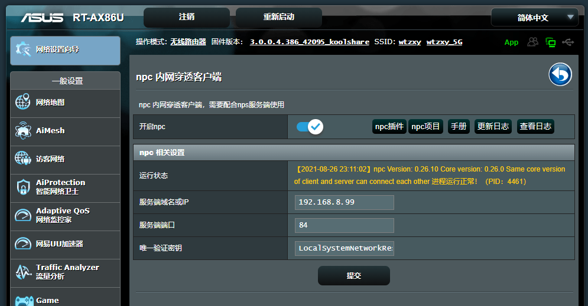

# KoolShare npc

npc server for Koolshare

## 说明

本插件参考了[frps插件](https://github.com/koolshare/rogsoft)的代码，根据[nps插件](https://github.com/ehang-io/nps)编译好的的包，进行封装成路由器插件。

## 更新日志：

Koolshare npc Changelog
-------------------------------------------
- 2021-08-26: v1.0.0 (npc版本:v0.26.10)
  - 第一个beta版本

## 运行图：

